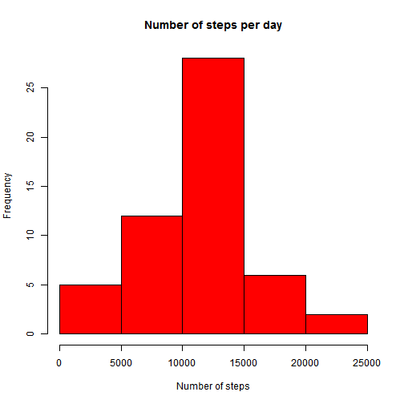

This is an R Markdown document. Markdown is a simple formatting syntax for authoring HTML, PDF, and MS Word documents. For more details on using R Markdown see <http://rmarkdown.rstudio.com>.


```r
activity_data <- read.csv("activity.csv")
library(plyr)
```
Here is the histogram of the total number of steps taken per day


```r
tmpdata <- ddply(activity_data,"date",summarise, sum = sum(steps))
hist(tmpdata$sum, xlab="Number of steps", col = "red", main="Number of steps per day")
```

 

The mean value is:


```r
mean(tmpdata$sum, na.rm = TRUE)
```

```
## [1] 10766.19
```
The median value is:


```r
median(tmpdata$sum, na.rm = TRUE)
```

```
## [1] 10765
```
Here is the plot of the average number of steps per time interval

```r
tmpdata1 <- ddply(activity_data,"interval",summarise, avg = mean(steps, na.rm=TRUE))
with(tmpdata1,plot(interval,avg,type='l', xlab="5 minute time interval",ylab="Average steps"))
```

 

The interval with the maximum average number of steps is:

```r
index <- which.max(tmpdata1$avg)
tmpdata1[index,]$interval
```

```
## [1] 835
```
The number of rows with NA values is:

```r
sum(!complete.cases(activity_data))
```

```
## [1] 2304
```
Creating a new dataset with missing values in the steps field, filled in with the mean values of the steps in each interval

```r
new_data <- arrange(merge(activity_data, tmpdata1, by ="interval", all=TRUE), date)
new_data$steps[is.na(new_data$steps)] <- new_data$avg[is.na(new_data$steps)]
new_data$avg <- NULL
```
Plot the new imputed data....

```r
newtmpdata <- ddply(new_data,"date",summarise, sum = sum(steps))
hist(newtmpdata$sum, xlab="Number of steps", col = "red", main="Number of steps per day (imputed data)")
```

 

The mean value of the imputed data is:


```r
mean(newtmpdata$sum, na.rm = TRUE)
```

```
## [1] 10766.19
```
The median value of the imputed data is:


```r
median(newtmpdata$sum, na.rm = TRUE)
```

```
## [1] 10766.19
```

As observed, the mean does not change with the imputed data. The new median value differs only slightly. The new median is equal to the new mean. So, we can conclude that imputing the data with average values did not impact the calculations much.

We now create a days column in the imputed data set which signifies if it is a weekend or a weekday

```r
new_data$day <- weekdays(as.Date(new_data$date))
new_data$day<-factor(ifelse(new_data$day%in%c('Saturday','Sunday'),'weekend','weekday'))
```

Now we plot the panel plot with the average number of steps for the weekend and weekdays 

```r
library(lattice)
avgwkdy <- ddply(subset(new_data,day=="weekday"),"interval",summarise, avg = mean(steps, na.rm=TRUE))
avgwknd <- ddply(subset(new_data,day=="weekend"),"interval",summarise, avg = mean(steps, na.rm=TRUE))
plot <- xyplot(avg ~ interval|which, make.groups(weekday=avgwkdy, weekend=avgwknd),xlab = "interval", ylab="average steps", type = "l",main = "Average Steps by Interval", layout = c(1, 2))
print(plot)
```

 

                        

=======
title: "Reproducible Research: Peer Assessment 1"
output: 
  html_document:
    keep_md: true
---


## Loading and preprocessing the data


## What is mean total number of steps taken per day?


## What is the average daily activity pattern?


## Imputing missing values


## Are there differences in activity patterns between weekdays and weekends?
>>>>>>> 80edf39c3bb508fee88e3394542f967dd3fd3270
